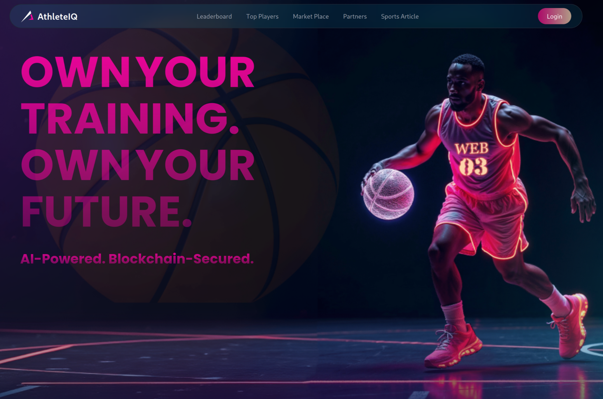
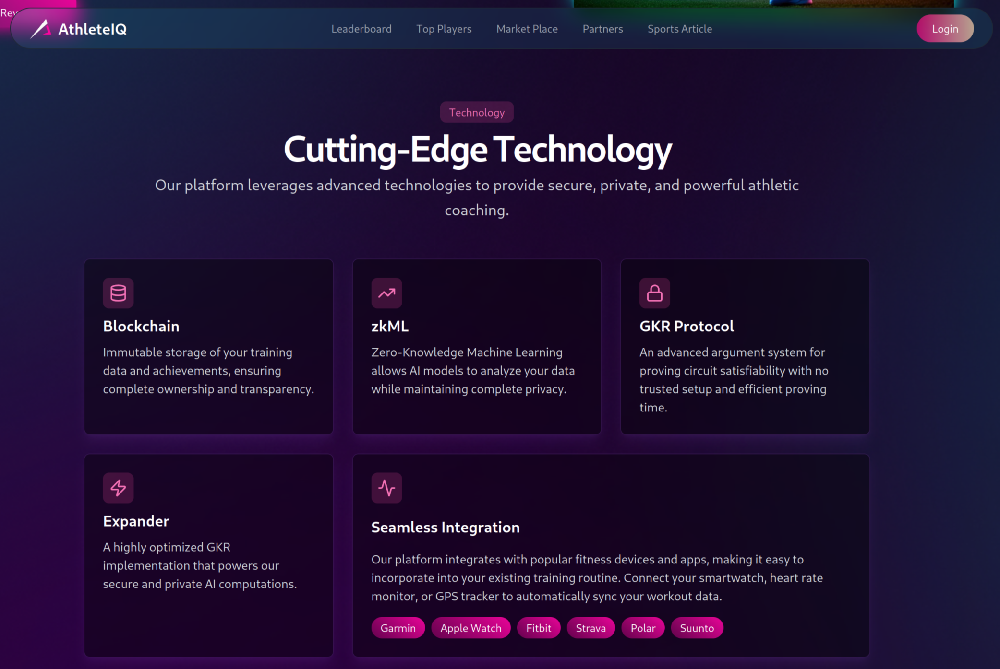
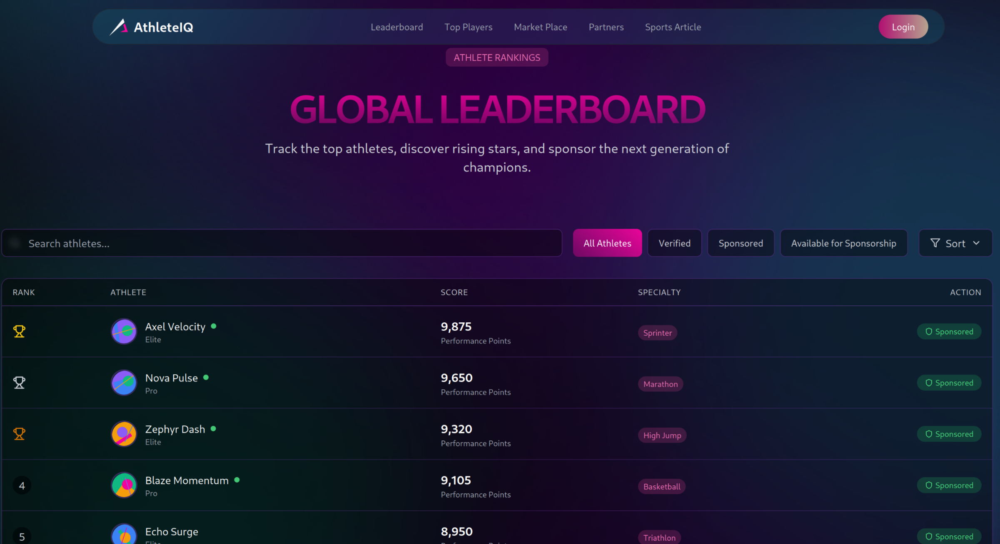
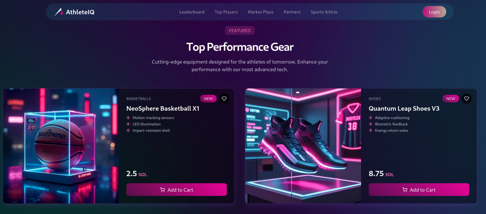
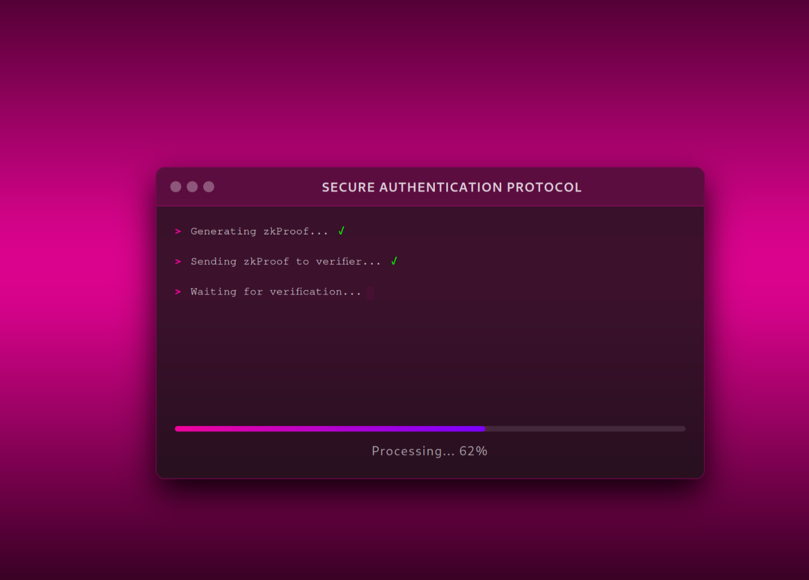
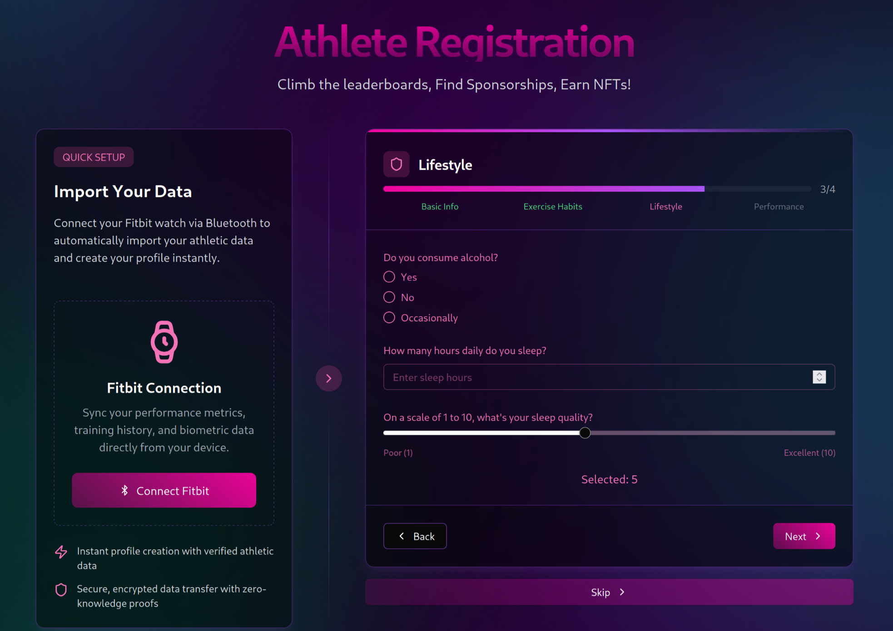
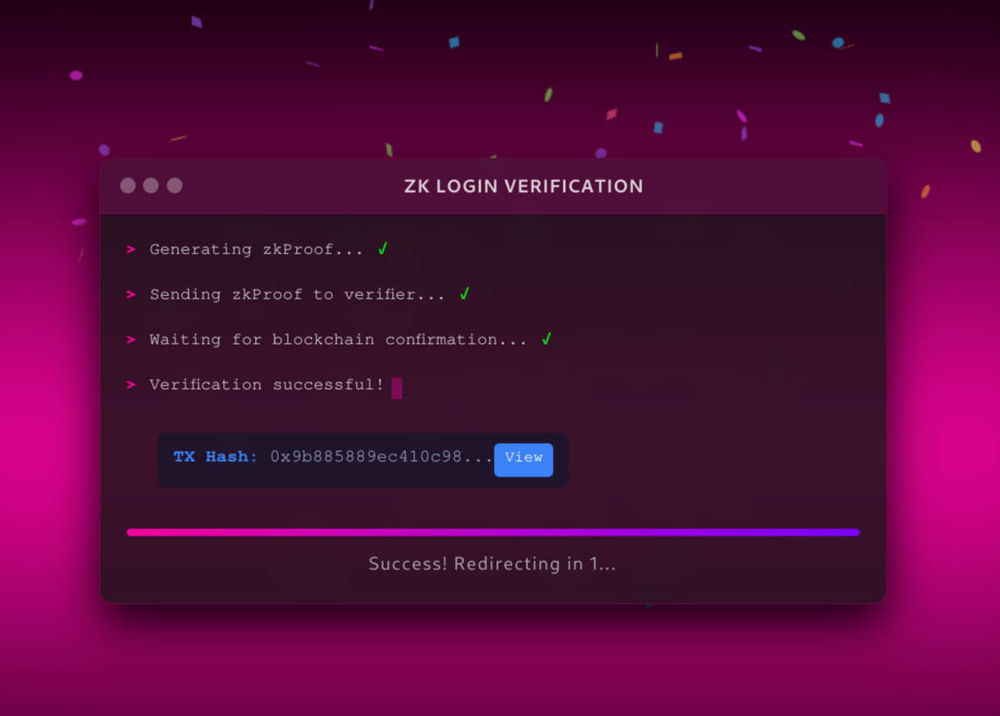

# AthleteIQ Coaching dApp

## Overview
**AthleteIQ** is a decentralized application designed to help athletes track their performance, manage training data, and receive AI-powered insights while ensuring data privacy through zero-knowledge proofs (ZKPs). The platform leverages blockchain technology for secure storage, smart contracts for reward distribution, and a tokenized incentive system to gamify training.

## Live
- [athlete-iq-nine.vercel.app](https://athlete-iq-nine.vercel.app/)

## Demo
- [youtube.com/watch?v=RCTMjqvU5bU](https://www.youtube.com/watch?v=RCTMjqvU5bU)

## ScreenShots
  
  
  
  
  
  
  

# Expander Zklogin Worflow
- code in `Backend/zkp_login/src/main.rs`
### Off chain Client aka Frontend [.ts]
- get JWT from OCID
- Decode JWT
- Get Salt POST /api/auth/salt [JWT] 
- Blake twice using [aud, sub, salt, email] => 128 bytes
- Do Keccake256 => 64 bytes
- Derive ETH using Keccake256 seed
- POST /zkproof [aud, sub, salt, email, address] 

### Off Chain Backend /zkproof [.ts] & [.rs]
- Get Decoded JWT
- Blake twice to get 128 bytes hash
- input [Blake, address] to Exapander circuit
- Do keccak256 inside circuit
- use hint to derieve ETH address from keccak256 seed inside circuit
- compare hint output with circuit expected output => (output == address)
- generate witness, compile proof
- return witness + proof
- sign message contains date+ proof + ETH address
- send to frontent

### Off chain Client aka Frontend [.ts]
- Query Sepolia Smart contract with signed message + address

### On Chain [.sol]
- decode message 
- check is right signare?
- check date > now
- check (client address) == (proof address)
- True? allow signin

## Contract
- live at [sepolia.etherscan.io/address/0x00EA3c8270868B9cF9C24a5E78cACDa9DfE8B485](https://sepolia.etherscan.io/address/0x00EA3c8270868B9cF9C24a5E78cACDa9DfE8B485)
- code: `Contracts/packages/hardhat/contracts/YourContract.sol`
## Features
### 1. Athlete Profile Management
- Decentralized athlete profiles.
- Stores personal details, performance metrics, and training history.
- Secure, keyless access using zkLogin.

### 2. Performance Data Analytics
- AI/ML-powered analysis of training data (e.g., running times, heart rate).
- Privacy-preserving analytics using zkML.
- Personalized training recommendations.

### 3. Real-Time Competition Tracking
- Immutable recording of competition results on the blockchain.
- Efficient result verification via GKR compression.
- Automated reward distribution via smart contracts.

### 4. Tokenized Rewards System
- Athletes earn **Iten tokens** for training and competition achievements.
- NFTs for milestones (e.g., completing a marathon).
- Gamified leaderboards and achievements.

### 5. Secure Data Sharing
- Controlled sharing of performance data with coaches, scouts, or sponsors.
- Zero-knowledge proofs (zkSNARKs/zkSTARKs) for privacy-preserving data sharing.

## Tech Stack
### Backend (Flask)
- **Flask**: Backend framework.
- **MongoDB**: NoSQL database for storing user data.
- **IPFS**: Decentralized storage for large data files.
- **TensorFlow.js/Python**: AI/ML for performance analysis.
- **zkSNARKs/zkSTARKs**: Privacy-preserving computations.

### Blockchain
- **Solidity**: Smart contract development.
- **Ethereum/Polygon**: Blockchain networks.
- **Hardhat**: Smart contract development environment.
- **Ethers.js**: Blockchain interaction.

### Frontend
- **React/Next.js**: User interface framework.
- **Web3.js/Ethers.js**: Blockchain interactions.

### Authentication
- **zkLogin**: Secure, keyless access.
- **MetaMask**: Web3 authentication.

## Installation & Setup
### Prerequisites
- Python 3.x
- Node.js & pnpm
- MongoDB
- MetaMask browser extension

### Backend Setup (Flask)
```bash
# Clone the repository
git clone https://github.com/Njine/AthleteIQ
cd AthleteIQ
cd Backend
# Set up a virtual environment
python -m venv venv
source venv/bin/activate  # On Windows, use `venv\Scripts\activate`

# Install dependencies
pip install -r requirements.txt

pyton app.py
```

### Frontend Setup (Next.js)
1. Install depends
```bash
# Navigate to the frontend directory
cd Client

# Install dependencies
pnpm install
```

2. Run a local network in the first terminal:

```bash
pnpm chain
```

This command starts a local Ethereum network that runs on your local machine and can be used for testing and development. Learn how to [customize your network configuration](https://docs.scaffoldeth.io/quick-start/environment#1-initialize-a-local-blockchain).

3. On a second terminal, deploy the test contract:

```bash
pnpm deploy
```

This command deploys a test smart contract to the local network. You can find more information about how to customize your contract and deployment script in our [documentation](https://docs.scaffoldeth.io/quick-start/environment#2-deploy-your-smart-contract).

4. On a third terminal, start your NextJS app:

```bash
pnpm start
```

Visit your app on: `http://localhost:3000`.

## Development Timeline
| Week  | Task |
|-------|------|
| 1-2   | MVP planning, setup, and environment configuration |
| 3-4   | Smart contract development and testnet deployment |
| 5     | Backend & frontend integration |
| 6     | AI/ML integration for performance analysis |
| 7     | Testing and debugging |
| 8     | UI/UX polish and final demo preparation |

## Deliverables
- **Smart Contracts**: Deployed on a testnet (e.g., Goerli, Polygon Mumbai).
- **Frontend**: Fully functional Next.js interface.
- **Backend**: Flask API for data processing and AI integration.
- **AI/ML Models**: Performance analytics and insights.
- **Demo Video & Presentation**: Showcasing the dApp’s features.

## Future Roadmap
- **Advanced Analytics**: More AI-powered insights for training optimization.
- **Sponsorship Platform**: Integration with sponsors for branded rewards.
- **Community Features**: Decentralized athlete collaboration.
- **Governance**: Token-based voting for platform upgrades.

## License
Copyright (C) 2024
Licensed under the GPLv3 License
## Authors

- Njine - [GitHub](https://github.com/Njine/) / [Twitter](https://x.com/_) / [LinkedIn](https://www.linkedin.com/in/_/)
- Kedir Jabir - [GitHub](https://github.com/IbnuJabir) / [Twitter](https://x.com/Ibnu_J1) / [LinkedIn](https://www.linkedin.com/in/ibnu-jabir/)
- Noor Amjad - [GitHub](https://github.com/Justxd22) / [Twitter](https://twitter.com/_xd222) / [LinkedIn](https://www.linkedin.com/in/noor-amjad-xd)
- _AYOUB ZAKARYA - [GitHub](https://github.com/aybzakaria5/) / [Twitter](https://x.com/Zack5ayb_) / [LinkedIn](https://www.linkedin.com/in/ayoubzakarya/)
- Betty - 

